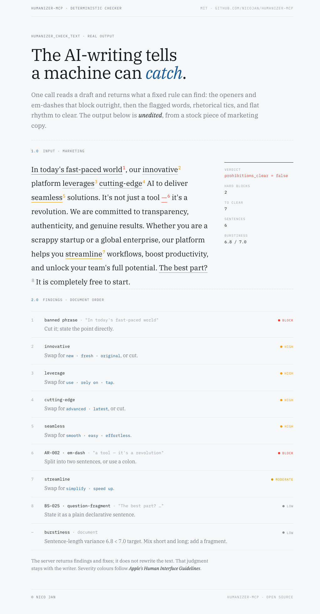

# mcp-humanizer

MCP server providing psycholinguistic, lexical, structural, and discourse-level rules for producing naturally human-sounding written content. Part of the **Human, an Education Collective** MCP ecosystem.

## Demo

<picture>
  <source media="(prefers-color-scheme: dark)" srcset="docs/media/checker-demo-dark.png" />
  
</picture>

Real output from `humanizer_check_text` on a stock piece of marketing copy. Two hard blocks, seven findings to clear, each with a fix. The server flags and suggests; it never rewrites the text.

**[Try it live in your browser →](https://nicojan.github.io/humanizer-mcp/)** The checker is ported to TypeScript and runs entirely client-side, with no server and no network. It is verified to produce the same findings as the Python engine (see [`web/`](web/)).

## What It Does

The reference Claude consults when writing or revising content that needs to read as human-authored. It supplies rules, patterns, substitutions, and before/after examples. It does **not** rewrite text itself.

## Data Dimensions

| File | Contents |
|---|---|
| `foundation.json` | Absolute rules (AR-001/002/003), core principle, two axes, priority hierarchy, application protocol |
| `lexical_patterns.json` | Flagged words, substitutions, vocabulary rules |
| `structural_patterns.json` | Sentence length, syntax, punctuation, POS targets |
| `sentiment_tone.json` | Neutral bias, emotional layering, subjectivity |
| `discourse_cohesion.json` | Transitions, markers, cohesive devices, repetition |
| `psycholinguistic_texture.json` | Cognitive load, self-monitoring, retrieval |
| `content_profiles.json` | Per-content-type adjustments |
| `anti_patterns.json` | Before/after AI → human rewrites |
| `caveats.json` | ESL, detector brittleness, ethical considerations |
| `self_review.json` | Human-likeness self-review rubric the calling model runs on its own draft (the `manual_review` list) |

## Tools

This is a **public read-only** MCP. There are no runtime write tools. Data updates flow through a git push to this repo, then a container restart on the host. There is no tool-level auth.

**Reference readers (12):** `humanizer_get_guide` (full composite), `humanizer_get_summary` (lightweight), `humanizer_get_application_protocol` (ordered traversal plan), `humanizer_get_foundation`, `humanizer_get_lexical_patterns`, `humanizer_get_structural_patterns`, `humanizer_get_sentiment_tone`, `humanizer_get_discourse_cohesion`, `humanizer_get_psycholinguistic_texture`, `humanizer_get_content_profile`, `humanizer_get_anti_patterns`, `humanizer_get_caveats`

**Checker (1):** `humanizer_check_text` runs a deterministic compliance check. Hard violations (block `prohibitions_clear`): em-dashes, stacked punctuation, banned phrases. Clearable findings (`must_clear`): comma splices and other punctuation issues, flagged terms, sentence-level banned structures (the `BS-*` regex/heuristic tells), rule-of-three density, cross-section uniformity, reality-assertion (credibility) density, and low burstiness. Read-only with respect to server state: it analyzes the supplied text and returns a findings report; it does not rewrite or store anything.

## Quick Start

```bash
pip install -r requirements.lock
PORT=8016 python src/server.py
```

## Regenerating the lock file

`requirements.txt` is the human-edited input with loose top-level bounds. `requirements.lock` is the deploy artifact and is what the Dockerfile installs. The deployed image runs Python 3.12, so the lock **must** be resolved against Python 3.12. A lock generated under a different Python version can pin wheels that don't exist for cp312, which breaks the Docker build.

Recommended (`uv` handles the Python version explicitly):

```bash
uv pip compile --python-version 3.12 requirements.txt -o requirements.lock
```

Alternative (`pip-tools`, which must run inside a Python 3.12 environment):

```bash
python3.12 -m venv .venv-3.12
source .venv-3.12/bin/activate
pip install pip-tools
pip-compile --output-file=requirements.lock requirements.txt
deactivate
```

## Deployment

See `docs/DEPLOYMENT.md` for the Docker Compose plus reverse-proxy or tunnel
setup. The server is stateless and read-only, so it also runs fine as a single
local container for development.

## Endpoint

Once deployed, connect any MCP client to `https://<your-host>/mcp` with no auth.
